# Project Diagrams

This file contains all the major diagrams for the project, providing a visual overview of the architecture, data models, and workflows.

---

## 1. System Architecture Diagram

This diagram illustrates the high-level, three-tier architecture of the application, showing the interaction between the frontend, backend, and database.

```mermaid
graph TD
    subgraph "Client-Side"
        User["👤 User <br/>(in Web Browser)"]
    end

    subgraph "Frontend Server (e.g., Vercel)"
        Frontend["🚀 Next.js Application"]
        subgraph "Frontend Components"
            direction LR
            FE_UI["React UI Components"]
            FE_Routing["Pages & App Router"]
            FE_State["State Management <br/>(useState, useEffect)"]
            FE_Styling["Tailwind CSS"]
        end
        Frontend --> FE_UI & FE_Routing & FE_State & FE_Styling
    end

    subgraph "Backend Server"
        Backend["🐍 FastAPI API"]
        subgraph "Backend Components"
            direction LR
            BE_API["API Routers <br/>(/auth, /schemes, etc.)"]
            BE_Logic["Business Logic <br/>(Filtering, Eligibility)"]
            BE_ORM["SQLAlchemy ORM <br/>(Data Mapping)"]
            BE_Security["Security <br/>(JWT, PIN Hashing)"]
        end
        Backend --> BE_API & BE_Logic & BE_ORM & BE_Security
    end

    subgraph "Data Store"
        DB["🗄️ Database <br/>(e.g., SQLite, PostgreSQL)"]
    end

    User -- "Interacts with UI (HTTPS)" --> Frontend
    Frontend -- "Makes API Calls (HTTPS/REST)" --> Backend
    Backend -- "Queries & Persists Data (SQL)" --> DB
```

---

## 2. Backend Class Diagram

This diagram shows the main data models (classes) in the backend and their relationships.

---

## 3. Detailed Workflow Diagram

This diagram provides a detailed, step-by-step view of the core user flows, including registration, login, profile management, scheme filtering, and logout.

