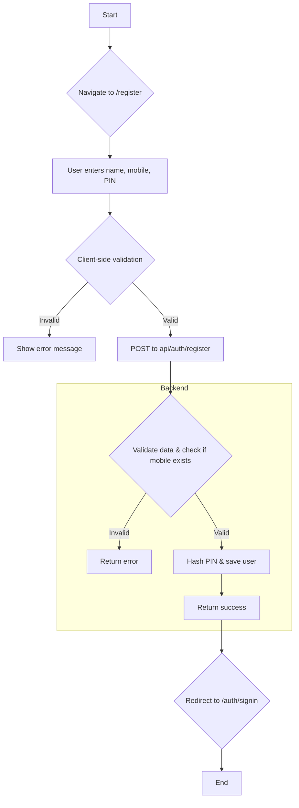
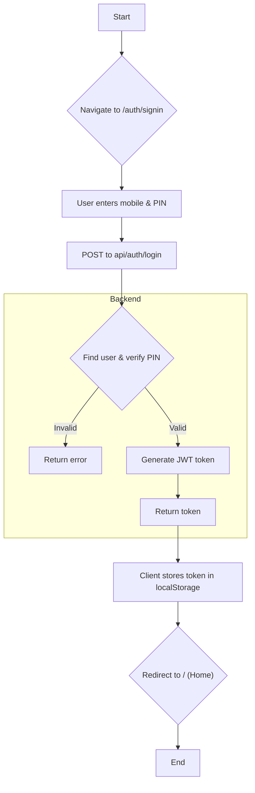
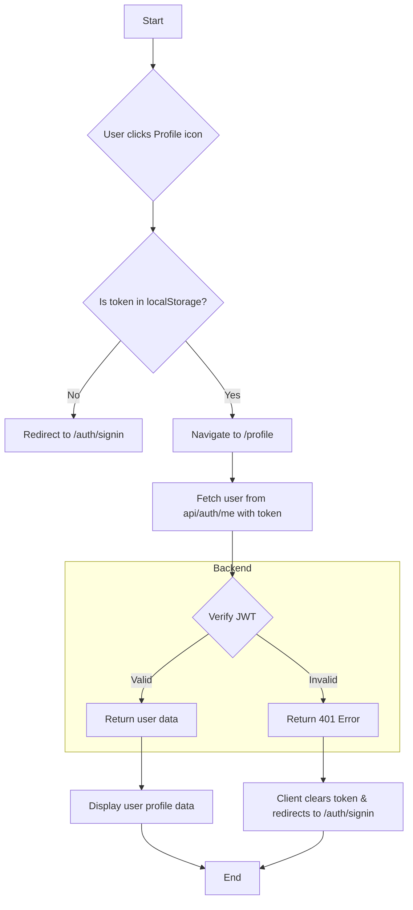
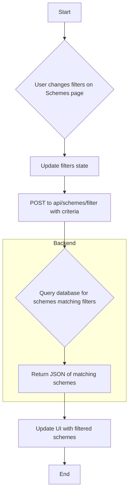
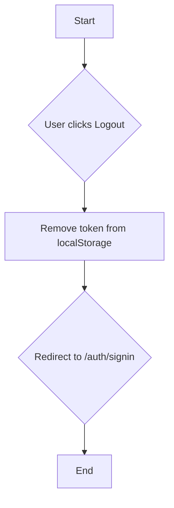

# Project Overview

This document provides a high-level overview of the main flows in the project, including textual explanations and diagrams for each major feature. You can view the diagrams as Mermaid code blocks below, or export them as images using the [Mermaid Live Editor](https://mermaid.live/).

---

## 1. User Registration

**Flow Explanation:**
- User navigates to the registration page and enters their details.
- Client validates the input.
- If valid, sends a registration request to the backend.
- Backend checks for existing user, hashes the PIN, and saves the user.
- On success, user is redirected to the sign-in page.

**Diagram:**

**Image Placeholder:**
> 
> *(Export the above Mermaid diagram as an image if needed)*

---

## 2. User Login

**Flow Explanation:**
- User navigates to the sign-in page and enters their credentials.
- Client sends a login request to the backend.
- Backend verifies the user and PIN, generates a JWT token, and returns it.
- Client stores the token and redirects to the home page.

**Diagram:**

**Image Placeholder:**
> 
> *(Export the above Mermaid diagram as an image if needed)*

---

## 3. Profile Management

**Flow Explanation:**
- User clicks the profile icon.
- If a token is present, navigates to the profile page.
- Profile page fetches user info using the token.
- If the token is invalid, user is redirected to sign-in and the token is cleared.
- If valid, user profile data is displayed.

**Diagram:**

**Image Placeholder:**
> 
> *(Export the above Mermaid diagram as an image if needed)*

---

## 4. Scheme Filtering

**Flow Explanation:**
- User changes filters on the schemes page.
- Client updates the filter state and sends a request to the backend.
- Backend queries the database for matching schemes and returns them.
- UI updates with the filtered schemes.

**Diagram:**

**Image Placeholder:**
> 
> *(Export the above Mermaid diagram as an image if needed)*

---

## 5. User Logout

**Flow Explanation:**
- User clicks the logout button.
- Client removes the token from localStorage and notifies other components.
- User is redirected to the sign-in page.

**Diagram:**

**Image Placeholder:**
> 
> *(Export the above Mermaid diagram as an image if needed)*

---

*To export diagrams as images, copy the Mermaid code block into [Mermaid Live Editor](https://mermaid.live/) and use the export function.* 